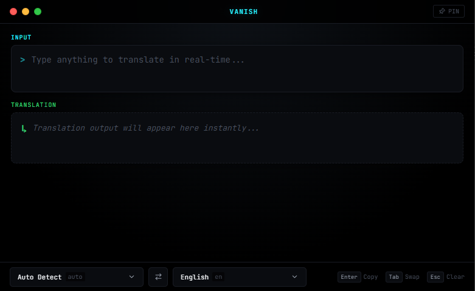

<div  align="center">

#  Vanish

  

**The Zero-Latency, Privacy-First Terminal Prompt Translator.**

*Type freely. Translate keystroke-by-keystroke in milliseconds. Leaves zero trace.*

  

[](LICENSE)

[](https://github.com/EditSquex/vanish/releases)

[](https://github.com/EditSquex/vanish)

[](https://github.com/EditSquex/vanish)

  

<br  />

  



  

</div>

  

---

  

##  The Philosophy

  

Most existing translators are bloated. They force you to keep browser tabs open, sit through subscription upsells, copy-paste across windows, or wait seconds just for a simple sentence. Worse yet, conventional cloud translation tools track your keystrokes, log your clipboard data, and store your queries on remote servers.

  

**Vanish** was designed with three uncompromised principles:

  

1.  **Zero Latency (Sub-50ms Speed)**: You don't hit "Submit" or wait for a loading spinner. The instant your fingers strike the keys, your translation is already calculated and displayed with in-memory caching and real-time streaming.

2.  **Absolute Privacy (Zero Telemetry)**: No user accounts, no telemetry collectors, no Google Analytics, no crash loggers, and no cloud databases. What you type stays strictly on your machine.

3.  **Frictionless Workflow**: A single, distraction-free OLED black prompt. Type what you think, press `Enter` to copy directly to your clipboard, and continue with your gaming, coding, or chatting without losing focus.

  

---

  

##  249 World Languages & Dialects

  

Vanish provides instant access to **249 world languages and regional language variations** powered directly by neural translation networks.

  

-  **Full Global Coverage**: From widely spoken global languages (English, Turkish, German, Spanish, French, Russian, Japanese, Arabic, Chinese) to regional dialects, minority languages, and rare language families.

-  **Context-Aware Accuracy**: Enhanced with semantic heuristics to eliminate ridiculous dictionary slips and awkward literal blunders (e.g. natural human phrasing without unintentional vulgarities).

-  **Custom Search Drop-up Picker**: A sleek, pitch-black custom selector that opens smoothly upwards with instant fuzzy search filtering.

  


  

---

  

##  Download & Run

  

You do **not** need to install Node.js, Python, or compile anything to use Vanish on Windows.

  

1. Head over to the **[Releases](https://github.com/EditSquex/vanish/releases)** page.

2. Download the standalone portable executable: **`Vanish.exe`**.

3. Double-click to launch immediately. No installation or administrative privileges required.

  

---

  

##  Development & Building from Source

  

If you want to run the project locally or build your own portable executable:

  

###  Prerequisites

- Node.js 18+

- npm or pnpm

  

###  1. Clone & Install

```bash

git clone  https://github.com/EditSquex/vanish.git

cd  vanish

npm install

```

  

###  2. Run in Development Mode

```bash

# Launch web client

npm run  dev

  

# Launch desktop Electron window

npm run  electron:dev

```

  

###  3. Build Standalone Portable Windows .exe

```bash

npm run  dist

```

The resulting `Vanish.exe` will be generated inside the `release/` directory.

  

---

  

##  Privacy Guarantee

  

Vanish is fully open-source under the MIT license. You can inspect every line of source code:

-  **No Analytics**: 0 tracking scripts.

-  **No Background Servers**: No custom telemetry backends.

-  **Local Settings**: Preferences (such as Always on Top) are stored exclusively in your local browser/app storage.

  

---

  

##  License

  

Distributed under the **MIT License**. See `LICENSE` for more information.